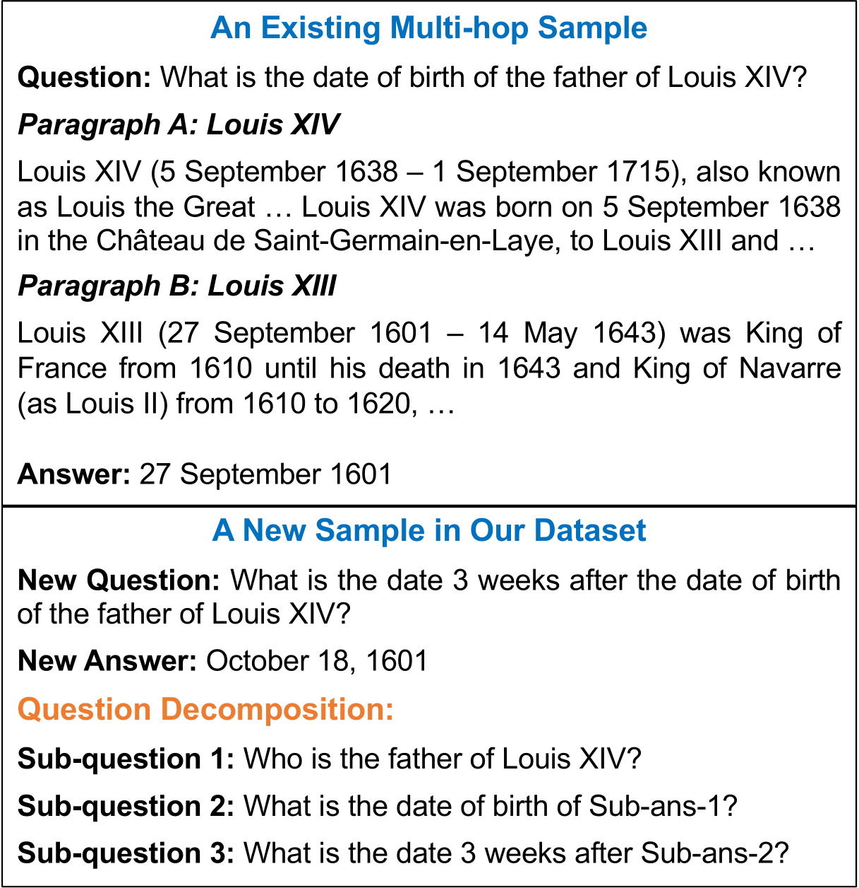
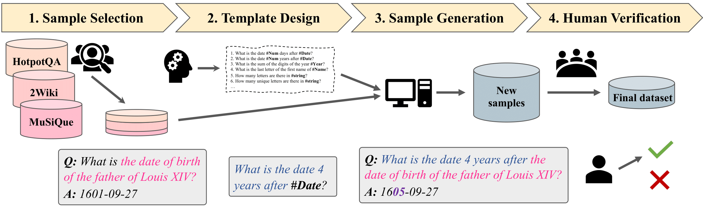
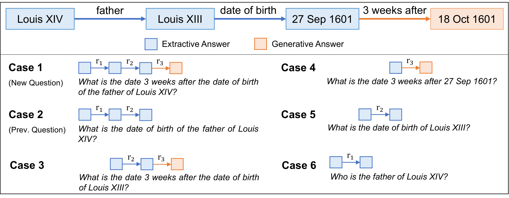

# MoreHopQA: More Than Multi-hop Reasoning

This repository contains the code to run the evaluation and analyses for MorehopQA: More Than Multi-hop Reasoning.  
We also provide the dataset on [Huggingface](https://huggingface.co/datasets/alabnii/morehopqa).

---
## The dataset

We propose a new multi-hop dataset, MoreHopQA, which shifts from extractive to generative answers. Our dataset is created by utilizing three existing multi-hop datasets: [HotpotQA](https://github.com/hotpotqa/hotpot), [2Wiki-MultihopQA](https://github.com/Alab-NII/2wikimultihop), and [MuSiQue](https://github.com/StonyBrookNLP/musique). Instead of relying solely on factual reasoning, we enhance the existing multi-hop questions by adding another layer of questioning.  

<div align="center">

</div>

Our dataset is created through a semi-automated process, resulting in a dataset with 1118 samples that have undergone human verification.  

<div align="center">

</div>

For each sample, we share our 6 evaluation cases, including the new question, the original question, all the necessary subquestions, and a composite question from the second entity to the final answer (case 3 below)

<div align="center">

</div>

---
## Setup

First, create conda env and activate:

```
conda env create -f conda_env.yml
conda activate genhop
```

If running on cuda 11, install pytorch 2 for cuda 11:

```
pip3 install --upgrade --force-reinstall torch torchvision torchaudio --index-url https://download.pytorch.org/whl/cu118
```

To check, start a terminal with python 3 and check that
```
import torch
torch.cuda.is_available()
```
returns True.

To evaluate answer via NER, it is necessary to install the spacy model

```
python3 -m spacy download en_core_web_sm
```

Additionally, to run models from OpenAI, add the OpenAI API Key by

```
export OPENAI_API_KEY=*api_key*
```

### macOS
To run on macOS, it might be necessary to install no-mkl versions of numpy and pandas.

```
conda install nomkl
```

then

```
conda install numpy pandas
```

followed by

```
conda remove mkl mkl-service
```

## Run

To evaluate all models from the paper, run

```
run_evaluation.sh
```
To reproduce our result tables, we provide the `summarize_results.ipynb` notebook.

---

## License

<p xmlns:cc="http://creativecommons.org/ns#" xmlns:dct="http://purl.org/dc/terms/">The <a property="dct:title" rel="cc:attributionURL" href="https://github.com/Alab-NII/morehopqa">MorehopQA</a> dataset is licensed under <a href="https://creativecommons.org/licenses/by/4.0/?ref=chooser-v1" target="_blank" rel="license noopener noreferrer" style="display:inline-block;">CC BY 4.0</a></p>
